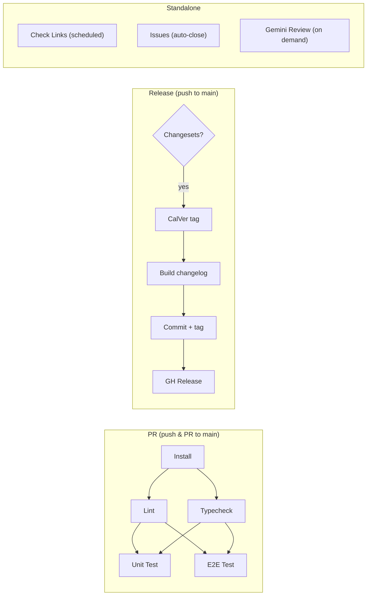

# CI / CD

## Overview



## Workflow summary

| Workflow | File | Trigger | Blocks merge? |
|----------|------|---------|:---:|
| **PR** | [`pr.yml`](workflows/pr.yml) | Push / PR to `main` | Yes |
| **Release** | [`release.yml`](workflows/release.yml) | Push to `main` | No |
| **Check Links** | [`check-links.yml`](workflows/check-links.yml) | 1st & 15th monthly + manual | No |
| **Issues** | [`issues.yml`](workflows/issues.yml) | Issue opened | No |
| **Gemini Review** | [`gemini-review.yml`](workflows/gemini-review.yml) | `/gemini review` comment on PR | No |

---

## PR (`pr.yml`)

Quality gate for every push and PR targeting `main`. Cancels in-progress runs on the same ref.

**Job chain:**

1. **Install** — checkout, pnpm cache, `pnpm install --frozen-lockfile`
2. **Lint** (needs install) — `pnpm lint.check` (Biome)
3. **Typecheck** (needs install) — `pnpm type.check` (Astro)
4. **Unit Test** (needs lint + typecheck) — installs Playwright Chromium, runs `pnpm test` (Vitest)
5. **E2E Test** (needs lint + typecheck) — installs Playwright, `pnpm build`, `pnpm test.e2e`

Lint and typecheck run in parallel; both test jobs run in parallel once those pass.

---

## Release (`release.yml`)

Runs on every push to `main`. Exits early if no `.changesets/*.md` files exist.

**Steps when changesets found:**

1. Generate CalVer tag via [`generate-version.sh`](#generate-versionsh)
2. Build changelog via [`build-changelog.sh`](#build-changelogsh)
3. Prepend entry to `CHANGELOG.md`
4. Set `calver` field in `package.json`
5. Delete processed changeset files
6. Commit, tag, push
7. Create GitHub Release with release notes

Manual `workflow_dispatch` runs skip file modifications and upload preview artifacts instead.

---

## Check Links (`check-links.yml`)

Scheduled link checker using [lychee](https://github.com/lycheeverse/lychee). Builds the site, then scans `dist/` for broken internal and external links.

- **Schedule:** 1st and 15th of each month, 06:00 UTC
- **Cache:** results cached by commit SHA, max age 1 day
- **Config:** [`.lychee.toml`](../.lychee.toml) — excludes localhost and mail links
- **Local:** `pnpm link.check` (full), `pnpm link.check.internal` (offline), `pnpm link.check.external` (HTTPS only)

---

## Issues (`issues.yml`)

Collaborator gate. When an issue is opened, checks author permission level. Non-collaborators (below `write`) get the issue auto-closed as "not planned".

---

## Gemini Code Review (`gemini-review.yml`)

On-demand AI code review. Triggered by commenting `/gemini review` on a PR (author must have repo association). Reacts with :eyes:, reads prompt from `.gemini/review-prompt.md`, and posts review via Gemini CLI.

---

## Helper scripts

### `generate-version.sh`

[`.github/scripts/generate-version.sh`](scripts/generate-version.sh)

Generates a [CalVer](https://calver.org/) tag in `YYYY.MM.DD[.N]` format:

- Base tag = today's date (`2026.03.21`)
- If that tag already exists, appends a counter (`.1`, `.2`, ...)
- Outputs `version=<tag>` to `$GITHUB_OUTPUT`

### `build-changelog.sh`

[`.github/scripts/build-changelog.sh`](scripts/build-changelog.sh)

Parses `.changesets/*.md` frontmatter (`type`, `scope`) and body. For each entry:

- Finds the original commit via `git log`
- Looks up associated PR via `gh pr list`
- Formats as: `- #<PR> <SHA> **scope**: summary`
- Groups by type (chore, ci, content, doc, feature, fix, test)

Outputs `/tmp/changelog_entry.md` and `/tmp/release_body.md`.

---

## Changeset workflow

```bash
pnpm changeset          # interactive prompt: type, scope, summary
git add .changesets/    # commit the .md file with your PR
```

On merge to `main`, the Release workflow picks up changeset files and publishes a versioned release. See [`scripts/README.md`](../scripts/README.md) for change types and details.

---

## Configuration

### Renovate ([`renovate.json5`](renovate.json5))

- Schedule: 1st of each month
- Range strategy: `pin` (exact versions)
- Auto-merge: minor + patch (grouped into one PR)
- Manual review: major updates, node/pnpm version bumps
- Post-update: `pnpmDedupe`

### Lychee ([`.lychee.toml`](../.lychee.toml))

- Excludes `localhost` / `127.0.0.1`
- Excludes mail links

---

## Runtime

All workflows use Node and pnpm versions pinned in `package.json`.
